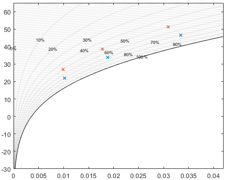

# moistAir类使用说明  Demo of moistAir class usage
  
本工具的物性参数计算方法都来自于ASHARE handbook，和NIST的refprop数据库焓值基准不是一套，使用时需要注意基准。如果有问题请联系panhjt@foxmail.com。
## 创建流股 Create stream
用摄氏度和相对湿度来创建流股。默认的流量是1kg/s，可以后续修改。  Create stream using degC and relative moisture. By default the flow rate is 1kg/s  
```air_30C_50RH = moistAir(30, 0.5);```  

## 更改流股性质 Change stream properties  
更改流股温度（摄氏度），保持绝对湿度不变  
Change stream temperature by degC/degK, retain vapour content  
`air.t = 50;`，`air.T = 273.15 + 50;`  
更改相对湿度，温度不变  
Change relative humidity, retain temperature  
```air.rh = 0.3;```  
更改绝对湿度（kg/kg干空气，ASHRAE手册叫做混合比）  
Change W(mixing ratio), W = M_water/M_dryair. See ASHRAE Handbook for detail  
```air.W = 0.1;```  
更改质量或体积流量（kg/s或m3/s），温湿度等性质不变，体积流量会自动随之更新  
Change mass/volume flow rate qm, kg/s, m3/s, retain temp. & vapour content  
```
air.qm = 2;
air.qv = 1;
```  
更改比焓kJ/kg，温度会随之自动更新  
Change enthalpy kJ/kg  
```air.h = 280;```  
单位干空气比焓kJ/kg干空气  
Change enthalpy based on dry air, kJ/kg_da  
```air.h_da = 280;```  

## 查询属性 Query properties
1. 直接查询流股本身的属性。查询温度时T为开尔文，t为摄氏度 Using object properties. T for degK and t for degC  
`air.t`，`air.T`，`air.pws;`  
2. 饱和蒸气压也可以使用类的静态方法 Using static method  
`moistAir.p_vsat(30);`  
3. 露点、湿球温度等当前不支持，短期可能也不会做 Dew point not available yet, under development

## 操作流股 Manipulate streams
直接用+来合并流股，合并过程中通过能量守恒获得焓值，再通过焓值反解出温度。  
 Merge streams using "+". Energy conservation applied to get mixture temp.
```  
air_stream_1 = moistAir(20, 0.3);  
air_stream_2 = moistAir(30, 0.5);  
air_stream_1 + air_stream_2;  
```  
可以用\*来直接给流股流量乘以倍数，其他性质不变  
Multiply stream flow rate by using "*". Temp. and moisture remain constant.
```  
air_stream = moistAir(30,0.5);  
air_stream.qm = 1;  
air_stream = air_stream * 2;  % qm = 2
```

定压加湿，向流股加入一定量和温度的水蒸气，能量守恒。用l/s指定加入的水的相态，默认是气态。  
Add moisture to stream (const pressure moisturizing process, energy balanced)
```
air_stream = air_stream.add_moisture(0.1, 30); % default "v" for vapor
air_stream = air_stream.add_moisture(0.1, 10, "l"); % "l" for liquid phase and "s" for solid
air_stream = air_stream.add_moisture(0.001, -5, "s");
```

相对湿度大于100%时去除雾/霜  
Remove fog/frost and update state to saturated if RH > 100%  
`air_stream = air_stream.update_to_sat();`

计算在一定的外循环比下最后室内达到平衡时的空气状态  
Get equilibrium state under certain circulation ratio
```
air_stream_1 = moistAir(20, 0.3);
air_stream_2 = moistAir(30, 0.5);
moistAir.get_eq_air(air_stream_1, air_stream_2, 0.5);
```

## Array usage
% create and index stream by arrays of properties.
% note array length of different properties must be either equal or 1  
% 1: temp in array, RH, qm all same
```
air_stream = moistAir([20, 30, 40], 0.3);
air_stream(2) % get stream t=30,rh=0.3
```
% 2: temp and RH in array
```
air_stream = moistAir([20, 30, 40], [0.3, 0.4, 0.5]);
air_stream(2) % get stream t=30,rh=0.4
```
% 3: temp and RH single, qm in array
```
air_stream = moistAir(20, 0.5);
air_stream.qm = [1,2,3];
air_stream(3) % get stream t=20, rh=0.5, qm=3
```
% "+" and "*" works in array form
% note that here behavior of "+" and "*"  is a little bit different
% "+" extend other properties to same dimension while "*" does not
```
air_stream = moistAir(20, 0.5);
air_stream.qm = [1,2,3];
air_stream + air_stream;
air_stream * 2;
```
% following functions can't work in array form yet, consider extract state point first
% air_stream = moistAir([20, 30, 40], [0.3, 0.4, 1.5])
% air_stream.update_to_sat

## Draw state point on diagram
```
air_stream_1 = moistAir([20, 30, 40], 0.7);
air_stream_2 = moistAir([25,35,45], 0.5);
moistAir.plot_enth_moisture_diagram(air_stream_1, air_stream_2);
```